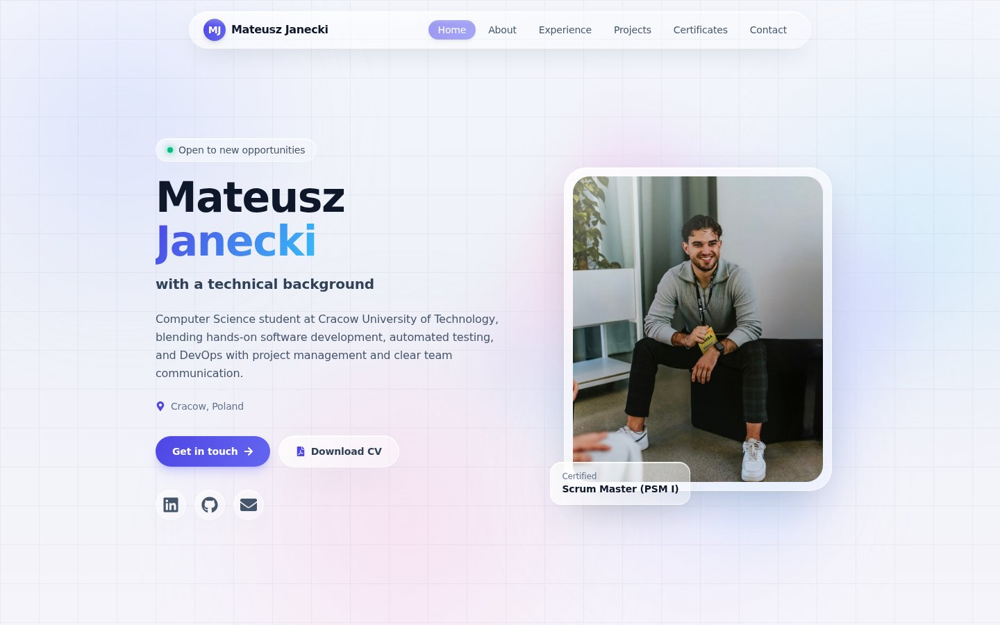

<div align="center">

# 🌐 janeckimateusz.com — Personal Portfolio

**The personal portfolio website of [Mateusz Janecki](https://www.linkedin.com/in/mateusz-j-621b1a196/)** — Computer Science student, certified Scrum Master (PSM I), QA & DevOps enthusiast.

[](https://github.com/JaneckiGit/janeckigit.github.io/actions/workflows/deploy.yml)
[](https://nextjs.org/)
[](https://react.dev/)
[](https://www.typescriptlang.org/)
[](https://tailwindcss.com/)
[](https://www.framer.com/motion/)

### 🔗 **Live site: [janeckimateusz.com](https://janeckimateusz.com)**

<a href="https://janeckimateusz.com">
  
</a>

</div>

---

## ✨ Features

- 🎨 **Liquid-glass design** — light, modern glassmorphism theme with subtle animated gradients
- ⌨️ **Animated hero** — typewriter effect cycling through roles (Scrum Master, QA & Test Automation, DevOps & Cloud…)
- 🧩 **Full CV in sections** — About, Experience, Education, Certificates, Projects and Contact
- 📱 **Fully responsive** — looks great from mobile to widescreen
- 🎬 **Scroll animations** — smooth section reveals powered by Framer Motion
- 🔍 **SEO-ready** — Open Graph tags, JSON-LD structured data, sitemap and robots.txt
- 📄 **Downloadable CV** — one click to grab the PDF
- 🚀 **Static export** — pre-rendered with `next build`, served from GitHub Pages via a custom domain

## 🛠️ Tech stack

| Layer | Technology |
|---|---|
| Framework | [Next.js 15](https://nextjs.org/) (App Router, static export) |
| UI library | [React 19](https://react.dev/) + [TypeScript 5](https://www.typescriptlang.org/) |
| Styling | [Tailwind CSS 4](https://tailwindcss.com/) |
| Animations | [Framer Motion](https://www.framer.com/motion/), [react-type-animation](https://www.npmjs.com/package/react-type-animation), [tsParticles](https://particles.js.org/) |
| Icons | [react-icons](https://react-icons.github.io/react-icons/) |
| CI/CD | GitHub Actions → GitHub Pages |
| Domain | [janeckimateusz.com](https://janeckimateusz.com) |

## 📂 Project structure

```
.
├── .github/workflows/deploy.yml   # CI/CD — builds & deploys to GitHub Pages
├── docs/                          # README assets
└── modern-portfolio/              # Next.js application
    ├── public/                    # Static assets (photos, CV, OG image)
    └── src/app/
        ├── components/            # Hero, About, Experience, Projects, …
        ├── layout.tsx             # Root layout, SEO metadata & JSON-LD
        ├── page.tsx               # Home page composition
        ├── sitemap.ts             # sitemap.xml
        └── robots.ts              # robots.txt
```

## 🚀 Getting started

```bash
# Clone the repository
git clone https://github.com/JaneckiGit/janeckigit.github.io.git
cd janeckigit.github.io/modern-portfolio

# Install dependencies
npm install

# Start the dev server (http://localhost:3000)
npm run dev

# Production build (static export to ./out)
npm run build
```

## 🔄 Deployment

Every push to `main` triggers the [deploy workflow](.github/workflows/deploy.yml):

1. Installs dependencies and builds the Next.js app (`modern-portfolio/`)
2. Exports a fully static site to `modern-portfolio/out`
3. Publishes it to GitHub Pages with the custom domain **janeckimateusz.com**

## 📬 Contact

<div align="center">

| | |
|---|---|
| 🌐 Portfolio | [janeckimateusz.com](https://janeckimateusz.com) |
| 💼 LinkedIn | [mateusz-j-621b1a196](https://www.linkedin.com/in/mateusz-j-621b1a196/) |
| 🐙 GitHub | [@JaneckiGit](https://github.com/JaneckiGit) |
| ✉️ Email | [mateuszjanecki04@gmail.com](mailto:mateuszjanecki04@gmail.com) |

Made with ❤️ in Cracow, Poland

</div>
